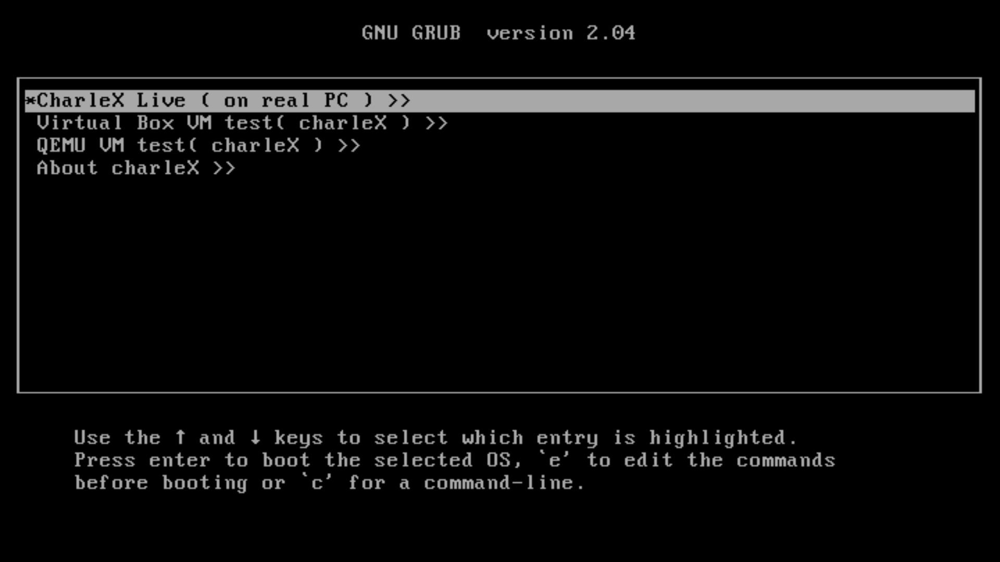
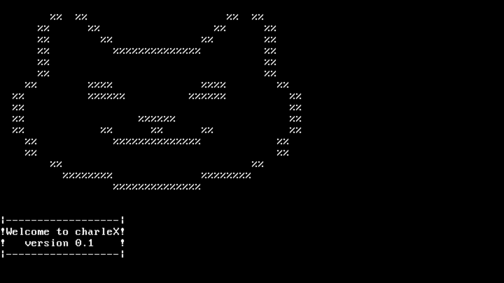
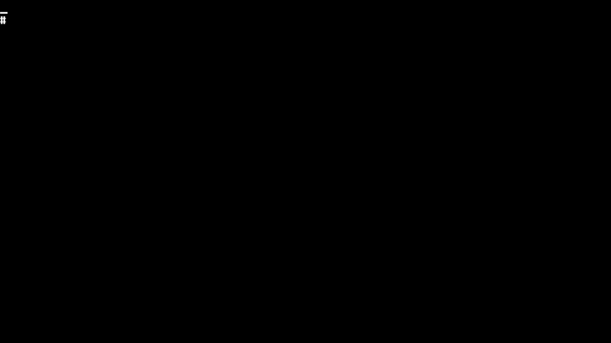

 

# charleX OS logo :

                  %%  %%                      %%  %%      
                 %%      %%                  %%      %%   
                 %%        %%              %%        %%   
                 %%          %%%%%%%%%%%%%%          %%   
                 %%                                  %%   
                 %%                                  %%   
               %%        %%%%              %%%%        %% 
             %%          %%%%%%          %%%%%%          %%
             %%                                          %%
             %%                  %%%%%%                  %%
             %%            %%      %%      %%            %%
               %%            %%%%%%%%%%%%%%            %%  
                %%                                    %%  
                   %%                              %%      
                     %%%%%%%%              %%%%%%%%     
                             %%%%%%%%%%%%%%               

# charleX OS

CharleX is a simple operating system. The kernel is written in C. I am still working on the source code to improve the kernel with many new features. My goal is to create a free, open-source operating system similar to Linux and FreeBSD. You can support us by contributing and improving the code for this project or by giving it a star.

# compile and run :
	$ make mkiso 

# OS and GCC dependencies(Debian/Ubuntu):
	$ make deps 
